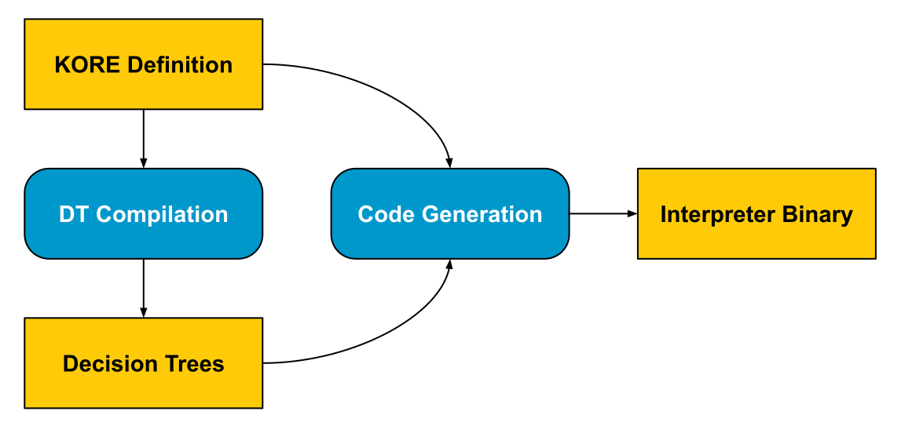
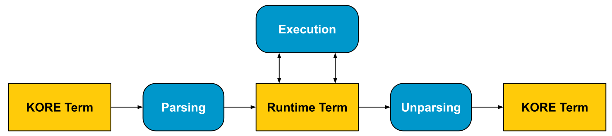

# LLVM Backend

The [K Framework](https://github.com/runtimeverification/k) LLVM backend
implements **fast concrete execution** for languages written in K. It does so by
compiling K definitions to specialized, native-code interpreters via [LLVM
IR](https://llvm.org/docs/LangRef.html). This document is intended as a
technical reference for developers of the LLVM backend, rather than for end
users of K. If you are a K user looking for technical advice, please [open an
issue on the main K
repository](https://github.com/runtimeverification/k/issues).

## Overview

## Contents

The LLVM backend documentation is split into two main sections: technical
documentation for the internal implementation details of the backend, and a
developer guide with best practices and conventions for working on the
repository.

* [Technical documentation](technical-documentation.md)
* [Developer guide](developer-guide.md)
